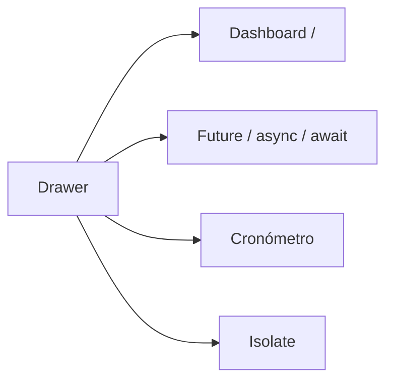
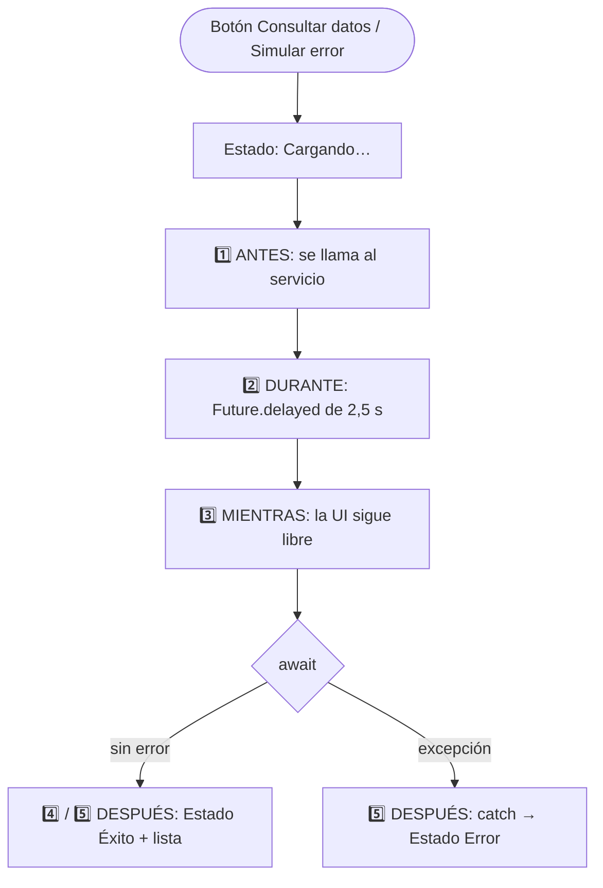
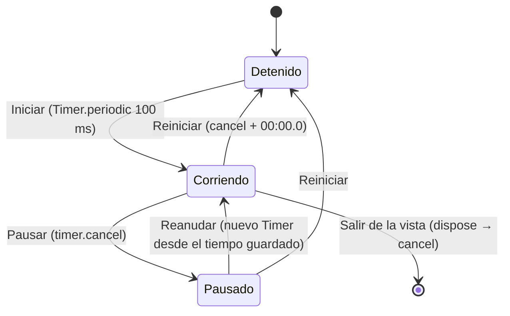
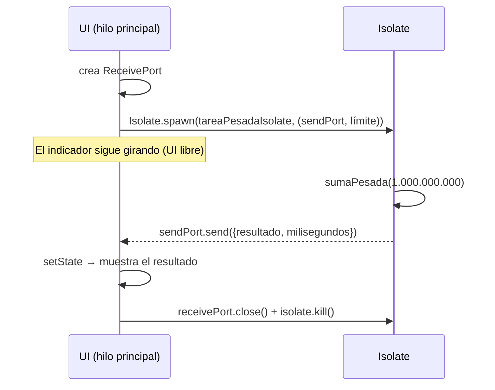

# TalleresMoviles

**Estudiante:** Juan Esteban Vera Castro 
**Código:** 230232042

## Pasos para ejecutar
1. `flutter pub get`
2. `flutter run` (en Android o Windows; la pantalla de Isolate no funciona en web)
3. `flutter test` para correr las pruebas

---

# Taller: Segundo plano (Future, Timer, Isolate)

Rama: `feature/taller_segundo_plano`

La app usa `go_router`. Todas las pantallas se abren desde el **Drawer** (botón de 3 líneas del AppBar).

## Estructura

```
lib/
├── main.dart                         # MaterialApp.router
├── routes/app_router.dart            # Rutas de la app
├── services/datos_service.dart       # Servicio simulado con Future.delayed
├── isolates/tarea_pesada.dart        # Función CPU-bound y punto de entrada del Isolate
├── views/
│   ├── asincronia/asincronia_screen.dart
│   ├── cronometro/cronometro_screen.dart
│   └── isolate/isolate_screen.dart
└── widgets/                          # BaseView y CustomDrawer
```

## ¿Cuándo usar cada uno?

| Herramienta | Cuándo usarla | Ejemplo en la app |
|---|---|---|
| **Future** | Para un valor que estará disponible **más adelante**: peticiones HTTP, lectura de archivos, base de datos. | `DatosService.consultarDatos()` retorna `Future<List<String>>`. |
| **async / await** | Para **esperar** un Future con código que se lee de arriba hacia abajo, sin bloquear la UI. Los errores se capturan con `try/catch`. | `AsincroniaScreen.consultar()` espera el servicio y cambia el estado. |
| **Timer** | Para ejecutar algo **después de un tiempo** (`Timer`) o **cada cierto intervalo** (`Timer.periodic`): cronómetros, cuentas regresivas, refrescos automáticos. Siempre hay que cancelarlo (`cancel()`) en `dispose`. | El cronómetro suma una décima cada 100 ms. |
| **Isolate** | Para trabajo **pesado de CPU** (cálculos grandes, procesar imágenes, parsear JSON enorme). Corre en otro hilo con su propia memoria, así que la UI no se congela. Se comunica por mensajes (`SendPort` / `ReceivePort`). | Suma de 1 a 1.000.000.000 con `Isolate.spawn`. |

> **Diferencia clave:** `Future`/`async`/`await` **no** crean otro hilo: solo esperan sin bloquear mientras otra cosa (red, disco, un temporizador) hace el trabajo. Si el trabajo es del propio procesador, un `await` no basta y la UI se congela; para eso está el **Isolate**.

## Pantallas

| Pantalla | Ruta | Qué demuestra |
|---|---|---|
| Dashboard Principal | `/` | Pantalla de inicio |
| Future / async / await | `/asincronia` | Estados *Cargando… / Éxito / Error* y orden de ejecución en consola |
| Cronómetro (Timer) | `/cronometro` | Iniciar / Pausar / Reanudar / Reiniciar, cancelación del timer |
| Isolate | `/isolate` | Tarea pesada en un Isolate vs. en el hilo principal |



## Flujo 1: Future / async / await



Salida en consola (orden real de ejecución):

```
1️⃣ ANTES -> Se llama al servicio
2️⃣ DURANTE -> El servicio empezó la consulta (esperando...)
3️⃣ MIENTRAS -> La UI sigue libre, el Future está pendiente
4️⃣ DURANTE -> El servicio recibió la respuesta
5️⃣ DESPUÉS -> Datos recibidos: 4 elementos
```

El mensaje 3️⃣ sale **antes** de la respuesta. Eso prueba que la función no se queda bloqueada esperando. Después de cada `await` se revisa `mounted`, para no llamar `setState` si el usuario ya salió de la pantalla.

## Flujo 2: Cronómetro



- El tiempo se muestra en un `Text` grande estilo marcador (`mm:ss.d`).
- Cada botón solo se habilita en el estado donde tiene sentido, así nunca hay dos timers corriendo a la vez.
- `dispose()` cancela el timer al salir de la vista (limpieza de recursos).

## Flujo 3: Proceso pesado con Isolate



- `tareaPesadaIsolate` es una función **top-level**, como exige `Isolate.spawn`.
- El botón **Ejecutar sin Isolate** hace el mismo cálculo en el hilo principal: el indicador de carga se congela. Así se ve la diferencia.
- Si se sale de la pantalla durante el cálculo, `dispose()` cierra el puerto y termina el Isolate.

## Capturas
(inserta las imágenes)

---

# Taller 1: Widgets básicos

Aplicación que demuestra el uso de widgets básicos de Flutter
(Scaffold, AppBar, Text, Row, Image, ElevatedButton, Container, ListView)
y manejo de estado con setState(). El código está en la rama `feature/taller1`.

## Widgets usados
- Scaffold, AppBar, Text
- Row, Image.network, Image.asset
- ElevatedButton + setState
- Container, ListView (dentro de un Drawer, se abre con el botón de 3 líneas del AppBar)

### Widgets adicionales
- **Stack**: texto sobre una imagen con degradado (sección "Destacado")
- **GridView**: 4 celdas con icono y texto (sección "Accesos rápidos")

### Otros widgets de apoyo
- Drawer, ListTile, SnackBar
- Column, Padding, SizedBox, SingleChildScrollView (diseño)
